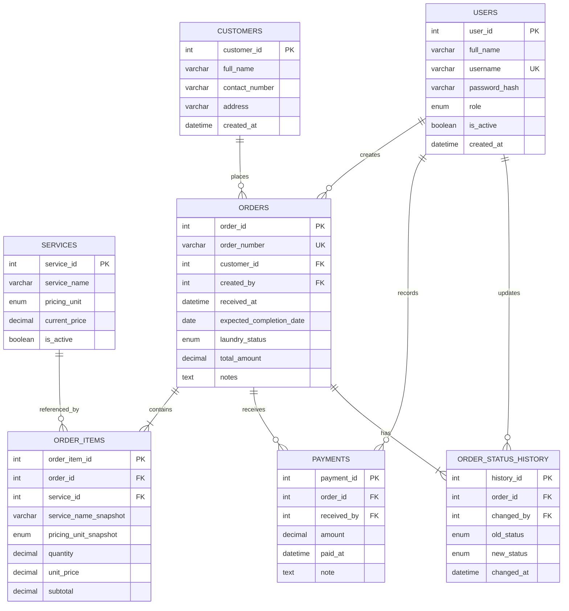

# LaundryLink
### Simple Laundry Shop Management System

LaundryLink is a Java-based desktop application designed to help a laundry shop manage customers, laundry orders, service prices, order statuses, and cash payments through a simple graphical interface.

This repository contains the development work for our group project.

## Project Status

**In development.** The features below describe the planned initial version and may not all be implemented yet.

## Project Objectives

- Organize customer and laundry order records.
- Calculate service charges automatically.
- Track laundry from acceptance to release.
- Record full and partial cash payments.
- Display daily order and payment summaries.
- Provide separate permissions for staff and the shop owner.

## Technology Stack

| Technology | Purpose |
|---|---|
| Java | Application logic |
| JavaFX | Desktop graphical interface |
| JavaFX CSS | Interface styling |
| MySQL | Database |
| JDBC | Database connectivity |
| Maven | Dependency management and build configuration |

## System Actors

### Admin / Shop Owner

The admin can perform all staff operations and additionally:

- Create and update staff accounts.
- Activate or deactivate staff accounts.
- Manage laundry services and prices.
- Delete eligible customer records and incorrectly entered orders.

### Laundry Staff

Staff can:

- Manage customer information.
- Create and view laundry orders.
- Update order statuses.
- Record cash payments.
- Release completed, fully paid orders.
- View daily summaries.

Customers do not have application accounts. Staff enter customer information and process transactions on their behalf.

## Planned Modules

### 1. Account Management

- Login and logout.
- View and edit own profile.
- Change password.
- Manage staff accounts.
- Apply role-based access restrictions.

### 2. Customer Management

- Add customer records.
- View and update customer details.
- Search by name or contact number.
- View customer order history.
- Delete customers who have no existing orders.

### 3. Service and Price Management

- Add laundry services.
- Set pricing units: kilogram or piece.
- Set and update service prices.
- Activate or deactivate services.
- View available services and prices.

### 4. Laundry Order Management

- Generate unique order numbers.
- Select an existing customer.
- Add one or more service items.
- Enter laundry weight or quantity.
- Calculate subtotals and the order total.
- Set an expected completion date.
- Add optional order notes.
- Search and filter orders.
- Edit or cancel eligible orders.
- Delete eligible orders entered by mistake.

### 5. Order Status Tracking

- View the current laundry status.
- Update orders through the processing stages.
- Record the employee and time of each status change.
- View status history.
- Release completed orders after full payment.

### 6. Payment Management

- Record cash payments.
- Accept partial or full payments.
- Calculate the remaining balance.
- Calculate change for cash received.
- Display payment status.
- View payment history.

### 7. Dashboard and Daily Summary

- Orders received today.
- Payments collected today.
- Orders currently being processed.
- Orders ready for pickup.
- Orders released today.
- Total outstanding balance.
- Daily order and payment summaries by selected date.

## Main Workflow

1. Staff logs in.
2. Staff selects or registers a customer.
3. Staff creates a laundry order.
4. The system calculates the service charges.
5. Staff records an optional initial payment.
6. Staff updates the laundry status as processing progresses.
7. Staff collects any remaining balance.
8. Staff releases the completed order.
9. The dashboard reflects the recorded activity.

## Laundry Statuses

| Status | Description |
|---|---|
| Received | Laundry has been accepted by the shop. |
| Washing | Laundry is being washed. |
| Drying | Laundry is being dried. |
| Ready for Pickup | Laundry is completed and awaiting collection. |
| Released | Laundry has been collected by the customer. |
| Cancelled | An eligible order was cancelled before processing. |

Normal processing sequence:

**Received → Washing → Drying → Ready for Pickup → Released**

## Payment Statuses

| Status | Condition |
|---|---|
| Unpaid | No payment has been recorded. |
| Partially Paid | The amount paid is below the order total. |
| Paid | The amount paid equals the order total. |

Laundry status and payment status are tracked separately.

## Business Rules

- Each order must have a customer and at least one service item.
- Weight and quantity must be greater than zero.
- Quantities for services priced per piece must be whole numbers.
- Order totals are calculated from service items.
- Service names, pricing units, and prices are saved in order items to preserve historical details.
- Changing a service price must not change previous orders.
- Order items can be edited only while the order is Received and has no payments.
- Cancellation is limited to unpaid orders that have not started processing.
- Only the admin can delete an unpaid order entered by mistake before processing starts.
- Customers with existing orders cannot be deleted.
- Payments must be greater than zero and must not exceed the remaining balance.
- Cash received above the balance is treated as change, not an additional payment.
- Orders can be released only when Ready for Pickup and fully paid.
- Deactivated staff accounts cannot log in.
- Passwords must be stored as secure hashes.

## Charge Calculation

```text
Item Subtotal = Quantity × Unit Price

Order Total = Sum of Item Subtotals

Remaining Balance = Order Total − Total Recorded Payments
```

Example:

```text
Service: Wash, Dry, and Fold
Weight: 4 kg
Price: ₱65.00 per kg

Order Total: ₱260.00
Initial Payment: ₱100.00
Remaining Balance: ₱160.00
```

Daily payments collected are based on payment dates, not order creation dates.

## Database Design

### Main Tables

| Table | Purpose |
|---|---|
| users | Admin and staff accounts |
| customers | Customer information |
| services | Laundry services and current prices |
| orders | Order information and current laundry status |
| order_items | Services, quantities, and saved prices for each order |
| payments | Cash payment records |
| order_status_history | History of order status changes |

### Entity Relationship Diagram



Use MySQL `DECIMAL` and Java `BigDecimal` for monetary calculations.

## Group Responsibilities

Replace the placeholders below with the group members' names.

| Member | Assigned Modules | Additional Responsibility |
|---|---|---|
| Member 1 | Account Management | Shared navigation, session handling, role checks |
| Member 2 | Customer Management; Service and Price Management | Customer and service validation |
| Member 3 | Laundry Order Management; Order Status Tracking | Charge calculation and status history |
| Member 4 | Payment Management; Dashboard and Daily Summary | Balance calculation and summary queries |

Each member is responsible for their module's interface, database operations, validation, and testing.

All members participate in integration, documentation, and end-to-end testing. Member 1 assists Member 3 after completing account management.

## Development Milestones

- [ ] Finalize requirements and screen layouts.
- [ ] Create the database schema.
- [ ] Set up the JavaFX and Maven project.
- [ ] Implement login and role permissions.
- [ ] Implement customer management.
- [ ] Implement service and price management.
- [ ] Implement order creation and calculations.
- [ ] Implement order status tracking.
- [ ] Implement payments and release checks.
- [ ] Implement dashboard and daily summaries.
- [ ] Integrate all modules.
- [ ] Test the complete transaction workflow.
- [ ] Prepare setup instructions and demonstration data.

## Setup and Running

Exact setup commands will be added once the project structure and dependency versions are finalized.

Planned requirements:

- A compatible JDK.
- Maven.
- MySQL Server.
- An IDE such as NetBeans, IntelliJ IDEA, or VS Code.

Planned setup procedure:

1. Clone this repository.
2. Create the MySQL database.
3. Import the provided database schema when available.
4. Configure the database connection.
5. Build the project using Maven.
6. Run the JavaFX application.
7. Create the initial admin account using the project's setup procedure.

Do not commit database passwords or other credentials to the repository.

## Testing Checklist

- [ ] Invalid login credentials are rejected.
- [ ] Staff cannot access admin-only operations.
- [ ] Customer and service validation works.
- [ ] Orders cannot be saved without a customer or service items.
- [ ] Charge calculations are correct.
- [ ] Old orders retain their original prices.
- [ ] Partial payments update balances correctly.
- [ ] Invalid payments are rejected.
- [ ] Unpaid orders cannot be released.
- [ ] Status changes record the responsible employee.
- [ ] Daily summaries use the correct dates.
- [ ] Saved records remain available after restarting the application.

## Initial Version Exclusions

The initial version does not include:

- Customer accounts.
- Online booking.
- Pickup or delivery scheduling.
- Email notifications.
- Online payments.
- Advanced analytics.
- Multiple branches.

## Possible Future Enhancements

- Printable order receipts.
- CSV export.
- Database backup and restore.
- Discounts and additional charges.
- Pickup reminders.
- Multi-computer access.

These enhancements will be considered after the initial workflow is complete.

## Project Completion Goal

LaundryLink is ready for demonstration when a user can register a customer, create an order, record payments, update laundry statuses, release the fully paid order, and view the resulting daily summary.
